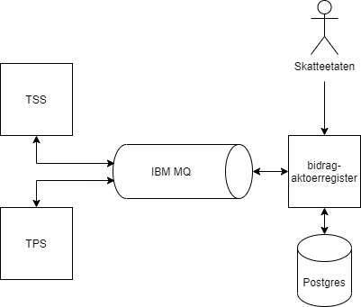

# Bidrag-Aktoerregister


* DEV-Intern: https://bidrag-aktoerregister.dev.intern.nav.no/ (må være koblet til naisdevice for å få tilgang).
* DEV-Ekstern: https://bidrag-aktoerregister.ekstern.dev.nav.no/.
* PROD: https://bidrag-aktoerregister.nav.no/. Applikasjonen kjører, men ingen har foreløpig tilgang til den da dette må konfigureres manuelt av `#tech-sikkerhet`.

Applikasjonen har ansvar for å holde oversikt over endringer i navn, adresse og kontonummer for aktører involvert i bidragssaker. Utover personer kan slike aktører være blant annet kommuner, institusjoner, spesifike avdelinger innenfor en oranisasjon, utlandske myndigheter eller sperrede bankkontoer.

For personer er det kun opplysninger om kontonummer som følges opp, men for de andre typene aktører følges også navn og adresse. Informasjonen om aktørene kan hentes ved kall med identtype og ident.

## Hendelse-API
I stedet for at konsumentene skal spørre om opplysningene for hver enkelt aktør jevnlig er det lagt opp et hendelses-API. En hendelse inneholder et sekvensnummer og en aktørId. Ved kall til hendelse-APIet sendes det med første sekvensnummer som ønskes og maksimalt antall hendelser.

Sekvensen i hendelses-strømmen vil alltid være stigende, men det kan forekomme hull i rekken. Spørres det etter et sekvensnummer som ikke eksisteres får man det neste i stedet, samt de etterfølgende hendelsene inntil det ikke er flere hendelser igjen eller maksimalt antall er nådd. Dersom det ikke finnes noen hendelser med etterspurt sekvensnummer eller høyere returneres en tom liste.

Konsumenten er selv ansvarlig for å huske hvilket sekvensnummer som skal hentes ut som det neste.

Hendelsene inneholder i seg selv ikke endringene, disse må hentes for aktørId'n dersom det er interessant for konsumenten.

## Endepunkter

### Hent aktør

Returnerer informasjon om aktør av type `identType` med id `ident`. `identType` kan være `PERSONNUMMER` eller `AKTOERNUMMER`. Ved oppslag på ident av type `PERSONNUMMER` returneres kun kontoinformasjon. Ved oppslag på ident av type `AKTOERNUMMER` returneres både kontoinformasjon og adresseinformasjon.

```
# Endepunkt
GET /aktoer/{identType}/{ident}

# Hent aktør med identType = PERSONNUMMER og ident = 17818798717
GET /aktoer/PERSONNUMMER/17818798717

# Hent aktør med identType = AKTOERNUMMER og ident = 80000365099
GET /aktoer/AKTOERNUMMER/80000365099
```

### Hent hendelser

Returnerer en liste av aktører som har blitt oppdatert siden sekvensnummer `fraSekvensnummer`. Antall aktøerer i den returnerte listen styres av parameteren `antall`. Den returnerte listen vil aldri inneholde flere innslag av samme aktør. Altså kan det hende at det siste sekvensnummeret som returneres er større enn `fraSekvensnummer` + `antall`. Den returnerte hendelseslisten vil være sortert etter sekvensnummer i stigende rekkefølge.

```
# Endepunkt
GET /hendelser?fraSekvensnummer=X&antall=Y

# Hente de 1000 første hendelsene
GET /hendelser?fraSekvensnummer=0&antall=1000

# Hent 1000 hendelser fra og med sekvensnummer 1001
GET /hendelser?fraSekvensnummer=1001&antall=1000
```

## Integrasjoner

### TSS

Ved forespørsel etter aktør på ident med identtype `AKTOERNUMMER` vil applikasjonen hente aktørinformasjon fra TSS dersom vi ikke allerede har informasjonen i databasen. Informasjonen hentes ved hjelp av en request kø i MQ som TSS lytter på. Respons skrives deretter tilbake på en midlertidig respons-kø som applikasjonen lytter på. Den mottatte aktøren lagres så i egen database før den returneres. Aktørinformasjon fra TSS inneholder både konto- og adresse-informasjon.

I tillegg til at applikasjonen henter aktørinformasjon om forespurte aktører dersom de ikke allerede finnes i databasen, er det også satt opp en batch-jobb som sjekker om aktørene med identtype `AKTOERNUMMER` har blitt oppdatert i TSS siden sist de ble hentet. Aktørene som er endret vil oppdateres i applikasjonens database. Dette medfører også nye hendelser for de oppdaterte aktørene.

### TPS

Ved forespørsel etter aktør med identtype `PERSONNUMMER` vil applikasjonen hente aktørinformasjon fra TPS dersom vi ikke allerede har informasjonen i databasen. Informasjonen hentes på samme måte som mot TSS, ved hjelp av request- og respons-køer. Aktørinformasjon fra TPS inneholder kun kontoinformasjon.

For å sørge for at aktører med identtype `PERSONNUMMER` holdes oppdatert abonnerer applikasjonen på endringsmeldinger relatert til kontoinformasjon. Endringsmeldingene dukker opp på en egen MQ-kø som applikasjonen kontinuerlig lytter på. Dersom endringsmeldingen gjelder en aktør vi har lagret i databasen oppdaterer vi informasjonen i henhold til endringsmeldingen. For TPS er vi derfor ikke avhengig av en batch-jobb slik vi er for TSS.



## Database

Applikasjonen benytter `PostgreSQL` i GCP for lagring av aktører og hendelser. Provisjonering av databasen gjøres gjennom konfigurasjon i `nais.yaml`. Alle nødvendige tabeller settes opp automatisk ved hjelp av `Flyway` migrasjoner, som kjøres ved oppstart av app. I tillegg til aktør og hendelse tabeller opprettes det også tabeller for håndtering av batch-jobb mot TSS. Dette er tabeller for å sørge for at vi ikke trigger den samme jobben på flere pods og for å kunne holde oversikt over status på jobb-kjøringer. For batch-jobber brukes `Spring-batch`. `Shedlock` brukes for å begrense batch-jobb til å kjøre på 1 pod.

`Flyway` migrerings-script ligger under `/resources/db/migration/` og følger en bestemt navn-konvensjon. Dersom man skal endre på tabeller i en eksisterende database må man opprette nye scripts/filer for dette. Hvis man forsøker å endre i eksisterende filer vil man få feil ved oppstart.

## XSD's og genererte klasser

For dataobjektene vi bruker i integrasjonene mot TSS og TPS bruker vi Java-klasser generert basert på XSD filer (`TPSSkjema.xsd` og `TSSSkjema.xsd`) for henholdsvis TSS og TPS. Java-klassene genereres ved bygg.

## Maskinporten

Endepunktene i applikasjonen krever maskinporten-tokens med scope `nav:bidrag:aktoerregister.read`. Foreløpig kan token med riktig scope genereres av NAV og Skatteetaten. Dette er også konfigurert i `nais.yaml`.

## Kubernetes secrets
Applikasjonen benytter én egendefinert Kubernetes secret i henholdsvis `dev-gcp` og `prod-gcp`. Passordet til IBM MQ. Passordet er representert gjennom miljøvariabelen `MQ_PASSWORD` i `application.properties`. I Kubernetes er den lagret på nøkkelen `bidrag-aktoerregister-mqpassword`, men når vi leser den ut i `nais.yaml` gjøres den tilgjengelig i pod'ene som miljøvariabelen `MQ_PASSWORD`.

## Kjør applikasjon lokalt

Å kjøre opp applikasjonen lokalt med all funksjonalitet lar seg dessverre ikke gjøre. Man kan kjøre opp applikasjonen, men vi vil ikke ha noen kobling mot MQ for forespørsler mot TSS og TPS. Ved hjelp av `docker-compose.yaml` kan man kjøre opp en IBM MQ instans samt en PostgreSQL instans som gjør at tjenesten ihvertfall starter ved bruk av profilen `local`. Dette krever imidlertid at du har Docker kjørende på maskina. Man kan derfor ihvertfall få testet `Flyway`-script og slike ting.

For å bruke `docker-compose.yaml` til å kjøre opp PostgreSQL og IBM MQ må man stå på rotnivå av prosjektet i terminalen og kjøre 

```docker-compose up -d```

Nå vil PostgreSQL, PgAdmin og IBM MQ starte. Åpne PgAdmin på localhost:5050 og logg inn med brukernavn `admin@admin.com` og passord `root`. På forsiden av PgAdmin, legg til en ny server og koble til. 

```
host: localhost eller host.docker.internal
port: 5432
database: test_db
username: root
password: root
```

Deretter må man inn på IBM MQ instansen og gi applikasjonen noen rettigheter:

```
docker exec -it ibmmq_container bin/bash

setmqaut -m QM1 -t queue -n SYSTEM.DEFAULT.MODEL.QUEUE -p app +put +inq
```

Nå kan man kjøre opp applikasjonen med spring profilen `local`. Applikasjonen vil da starte uten problemer, og db tabeller vil opprettes.

## Kjøring av tester

Noen av testene benytter `testcontainers` som krever at Docker kjører på maskina.
